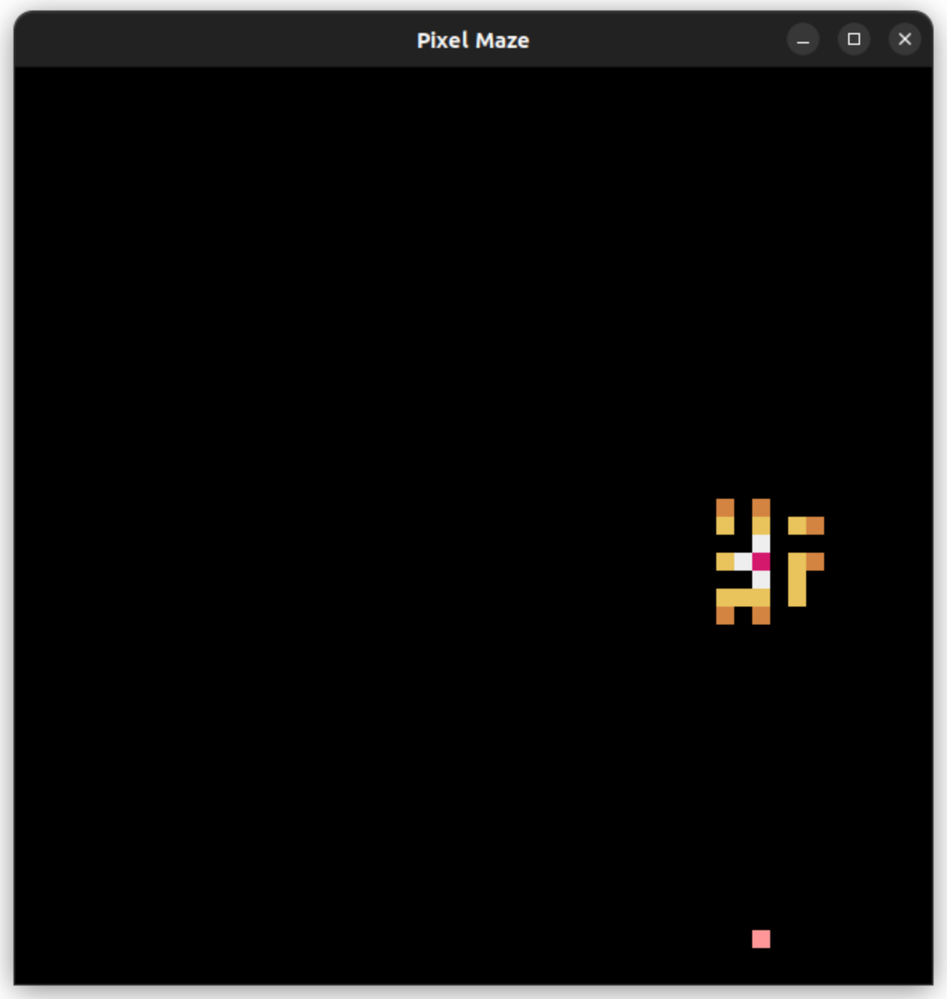
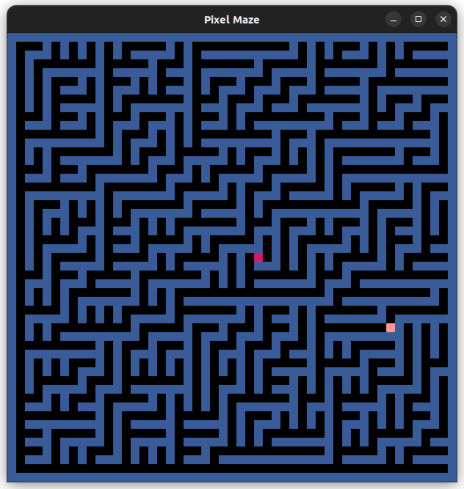

# Pixel Maze

A little maze game built with the [Pyxel](https://github.com/kitao/pyxel) game engine.

<p align="middle">


</p>

Mazes are generated using the following algorithms:

- Binary tree (with random NW, NE, SW and SE bias).

- More to come...

# Develop

1. Clone this repository.

    ```
    $ git clone git@github.com:themagiulio/pixelmaze.git
    ```

2. Create virtual environment.

    ```
    $ python -m venv .venv
    ```

3. Install packages.

    ```
    $ pip install -r requirements.txt
    ```

4. Run game.

    ```
    $ make run
    ```

5. Create executable.

    ```
    $ make build
    ```

# Settings

Colors and keys can be customized by editing the `settings.py` file.

## Colors

- `COL_BACKGROUND`: `int`<br>
  Background color.

- `COL_WALL`: `int`<br>
  Wall color.

- `COL_FINISH`: `int`<br>
  Finish color.

- `COL_PLAYER`: `int`<br>
  Player color.

- `COL_LIGHT_1`: `int`<br>
  Innermost light color.

- `COL_LIGHT_2`: `int`<br>
  Middle light color.

- `COL_LIGHT_3`: `int`<br>
  Outermost light color.

## Screen

- `SIZE`: `int`<br>
  Screen and maze size.

## Controls

- `KEY_CONTROL_UP`: `int`<br>
  Key to go up.

- `KEY_CONTROL_RIGHT`: `int`<br>
  Key to go right.

- `KEY_CONTROL_DOWN`: `int`<br>
  Key to go down.

- `KEY_CONTROL_LEFT`: `int`<br>
  Key to go left.

- `KEY_SWITCH_GENERATOR`: `int`<br>
  Key to switch maze generator.<br>
  **Note**: the switch will affect future maze generations.

## Gameplay

- `SHOW_WALL`: `bool`<br>
  Whether walls should be displayed.<br>
  **Note**: it is recommended to set `SHOW_LIGHT` to `True` when this setting is `False`.

- `SHOW_LIGHT`: `bool`<br>
  Whether light should be displayed.

# Acknowledgements

I wanted to reproduce the same look and feel of the maze game in the homepage of [Pyxel Studio's website](https://www.pyxelstudio.net/img/labyrinthe.gif). So, thanks to whoever created that!

I also want to thank [antigones](https://github.com/antigones/pymazes) and [Jamis Buck](http://www.mazesforprogrammers.com/) for the maze generation algorithms implemented in this game.

Finally, a big thanks go to [Kitato](https://github.com/kitao) for crafting the beautiful and simple game engine [Pyxel](https://github.com/kitao/pyxel).
